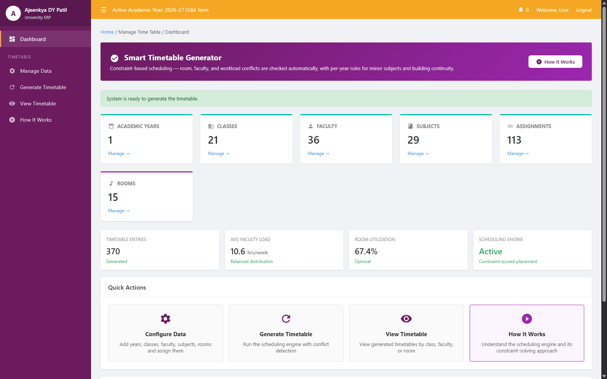
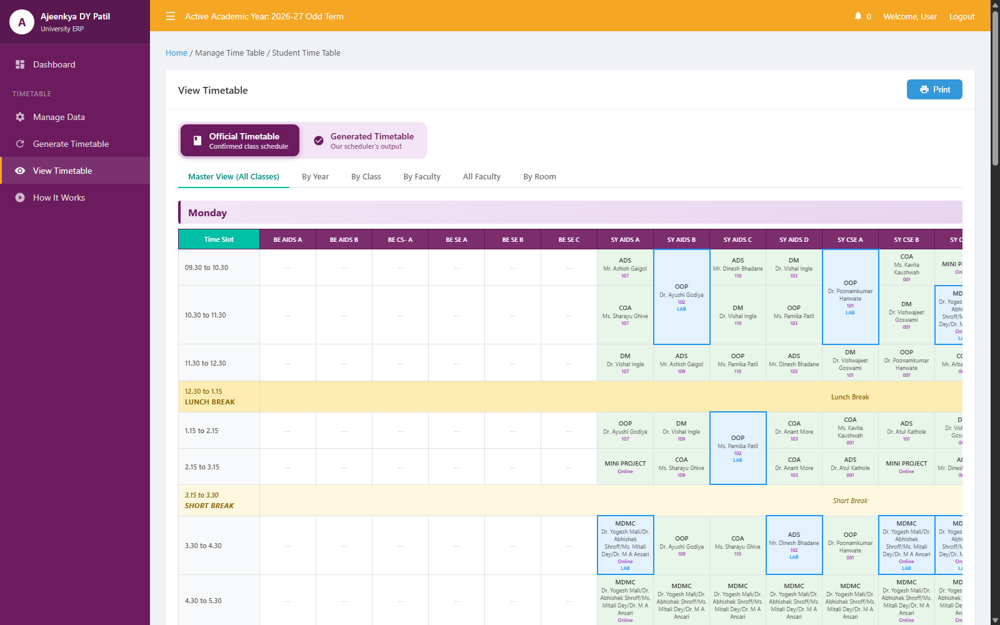
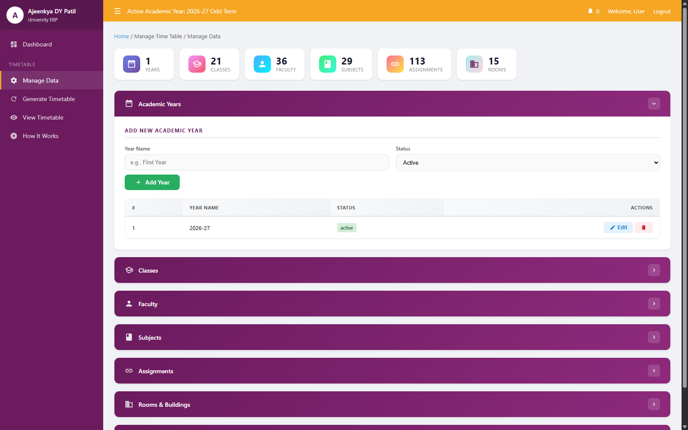

# Automatic Timetable Generator

## Overview

A constraint-based scheduling engine that generates conflict-free class timetables for a multi-year engineering department (FY/SY/TY/BE, CSE/AIDS/CS branches). Given a set of faculty, subjects, rooms, and per-year working days, it produces a complete weekly timetable with zero faculty double-bookings, zero room double-bookings, and lab sessions correctly paired into adjacent slots — something that is error-prone to do by hand once faculty count, subject count, and room constraints multiply.

The current dataset: 21 classes, 36 faculty, 29 subjects, 113 subject-faculty-class assignments, 15 rooms across multiple buildings, generating 370 timetable entries per run.

## Why Constraint Scoring Over Manual Placement

Manual timetabling scales badly. A department with 36 faculty and 113 assignments has thousands of possible day/slot/room combinations per session, and any single incorrect placement (a faculty member booked in two rooms at once, a lab split across a lunch break, a minor subject clashing with its designated slot) is easy to miss by eye and expensive to catch after publishing. This engine instead scores every valid candidate slot for a session and commits to the best one, with a repair pass for sessions that have no valid slot left by the time they're reached.

## The Scheduling Pipeline

1. **Class ordering.** Classes are scheduled TY before SY before FY — the most constrained years (fewest working days, more labs) go first, when the most slots are still free.

2. **Session expansion.** Each subject-faculty-class assignment is exploded into atomic session units: lab hours become 2-slot blocks (an odd `lab_hours_per_week` is floored, not rounded up), lecture hours become 1-slot units.

3. **Global sort.** All sessions across all classes are pooled into one list and sorted: minor subjects first, then labs, then by total weekly hours descending. This is greedy hardest-first placement across the whole department, not one class scheduled at a time.

4. **Scored placement.** For each session, every valid `(day, slot[, room])` combination is evaluated and the highest-scoring candidate wins.

   Hard filters — a candidate is discarded outright if:
   - the class is already booked that slot
   - the faculty is already booked that slot (waived for minor-subject sessions, which run as simultaneous cross-class sections)
   - the faculty's daily or weekly hour cap would be exceeded
   - the faculty has marked the slot as "avoid"
   - room capacity is below the class strength
   - the room is already booked (rooms named `Online` are exempt — they represent unlimited virtual capacity)
   - it's the last slot of the day on a year's designated day and the session isn't a minor subject (that slot is reserved for minors)
   - it's a lab session and the room isn't `room_type = lab`, or the two slots aren't numerically adjacent `slot_number`s (adjacency is checked on the slot number, not array position, since lunch/break rows are filtered out of the candidate list and would otherwise make non-adjacent slots look consecutive)

   Soft scoring — summed across every filter that passes:
   - `+5` if the room is a lab
   - `+5` if the room has AC
   - `+max(0, 20 - |room capacity - class strength|)` — rewards a tight capacity fit
   - `+100` if the slot matches the assignment's preferred slot
   - `+30` if the faculty has marked the slot "preferred"
   - `+200` if a minor subject lands on its year's designated minor-subject day
   - `+15` if the class already used that building earlier the same day (lecture sessions only — reduces cross-campus movement)

5. **Single-swap repair.** Any session that couldn't be placed triggers a repair pass: the engine looks at that faculty's already-placed sessions with a score under 100, evicts the lowest-scoring one, retries the original placement, then attempts to re-place the evicted session elsewhere. If the evicted session has nowhere to go, the eviction is undone and the original failure stands.

The full timetable is built in memory and committed in a single transaction — a regeneration clears the previous result rather than patching it incrementally.

## Views

| View | Purpose |
|---|---|
| Master | Every class, every day, in one grid |
| By Year | All classes within a single year of study |
| By Class | Single class's weekly schedule |
| By Faculty | Single faculty member's weekly load |
| All Faculty | Faculty workload comparison across the department |
| By Room | Room-by-room occupancy |

Each view can render either the **official** timetable (imported from the department's published Excel schedule) or the **generated** timetable (this engine's output), for direct comparison. Print export is handled entirely through `@media print` CSS — `@page { size: A4 landscape }`, per-day page breaks, and a document-title swap before `window.print()` so the browser's Save-as-PDF picks up a real filename. No PDF library is involved.

### Dashboard



### Generated Master Timetable



### Data Management



## Database

MySQL schema (`timetable_schema.sql`), core tables:

- `years`, `classes`, `faculty`, `subjects`, `subject_assignments` — the entities and their links
- `buildings`, `rooms` — physical spaces, with type/capacity/AC
- `time_slots`, `working_days`, `year_working_days` — the time grid and each year's fixed meeting days
- `faculty_unavailable`, `room_unavailable`, `faculty_preferences`, `faculty_absences` — constraint inputs to the scorer
- `timetable` — generated output
- `timetable_audit_log` — change history

## Installation & Setup

**Prerequisites:**
- PHP 7.4+ with `mysqli`
- MySQL/MariaDB
- Apache (tested on XAMPP)

**Setup:**
```bash
git clone https://github.com/D00M1909/automatic-timetable-generator.git
cd automatic-timetable-generator
```

Import the schema and seed data:
```bash
mysql -u root -p < timetable_schema.sql
mysql -u root -p timetable_db < timetable_db.sql
```

By default `includes/config.php` connects to `timetable_db` on `localhost` with user `root` and no password (standard XAMPP defaults). Override via `DB_HOST`, `DB_USER`, `DB_PASS`, `DB_NAME` environment variables if your setup differs.

Place the project under your web root and open `index.php`. From there:
1. **Manage Data** to configure years, classes, faculty, subjects, rooms, and assignments
2. **Generate Timetable** to run the scheduling engine
3. **View Timetable** to inspect the result by master grid, year, class, faculty, or room

